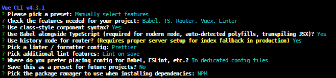

# Introduction

This repo hosts the Single Page Application (SPA) project that I've made following the [Real World VueJS course from Vue Mastery with #FREEWEEK2020](https://www.vuemastery.com/courses/real-world-vue-js). What makes my project special is that I included Typescript 😄

Source Code for Real World Vue Course can be found [here](https://github.com/Code-Pop/real-world-vue).

## Project setup

This is how I set up my project using the Vue-CLI. 



Some best practices recommended by the course
- Although we put components in both `/views` and `/components` directories, usually the purpose is different.
  - `/views`: put components that get loaded by Vue Router. some people call this folder `/pages` instead. 
  - `/components`: put other modular reusable components

### Compiles and hot-reloads for development
```
npm run serve
```

### Compiles and minifies for production
```
npm run build
```

### Lints and fixes files
```
npm run lint
```